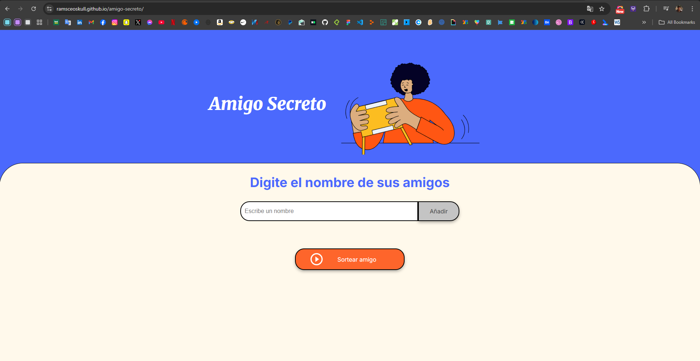

# 🎁 Amigo Secreto

Este proyecto es una aplicación web simple que permite realizar un sorteo de **amigo secreto** entre una lista de personas. Los usuarios pueden agregar nombres a una lista y luego seleccionar uno de forma aleatoria como el "amigo secreto".

## 🚀 Funcionalidades

- **Agregar nombres**: Los usuarios pueden escribir un nombre en un campo de texto y agregarlo a la lista con un botón "Adicionar".
- **Validación de entrada**: Si el campo está vacío al intentar agregar un nombre, se muestra una alerta solicitando un nombre válido.
- **Visualización de la lista**: Los nombres agregados se muestran en pantalla en tiempo real.
- **Sorteo aleatorio**: Al hacer clic en el botón "Sortear Amigo", se elige aleatoriamente un nombre de la lista y se muestra el resultado en pantalla.

## 🛠️ Tecnologías utilizadas

- HTML
- CSS
- JavaScript

## 📸 Vista previa



## 📦 Cómo usar el proyecto

1. Clona este repositorio:

   ```bash
   git clone https://github.com/tuusuario/amigo-secreto.git
   ```
2. Abre el archivo ```index.html``` en tu navegador.
3. Escribe los nombres de tus amigos, agregalos a la lista y realiza el sorteo. 🎉

Estado del proyecto | ✅ Finalizado
